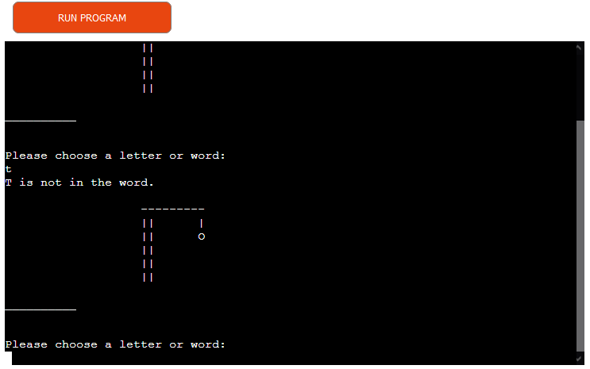

# HangMan Game

The Hangman game is a beautiful guess game for fun and spelling guess. you choose / guess a word or letter and if its in the database then you will get a pass which means you save the man from hanging otherwise its a fail which mean you hang the man piece by piece by every mistake and you have 6 fail attempts before the game is over. good luck.


## Demo

A live demo can be found [here](https://hangmanapp.herokuapp.com/). The Application was deployes by Heroku.

- - -

# Contents
* [Technologies Used](#technologies-used)
* [User Experience](#user-experience-ux)
* [Design](#design)
  * [Flowchart](#flowchart)
  * [Existing Features](#existing-features)
  * [Future Implementations](#future-implementations)
* [Deployment](#deployment)
  * [Heroku Deployment](#heroku-deployment)
  * [Run locally](#run-locally)
  * [Create data model and integrate using an API](#create-data-model-and-integrate-using-an-api)
* [Testing](#testing)
* [Credits](#credits)

- - - 

# Technologies Used
## Language
* Python3

## Libraries
* gspread 
* random


## Frameworks & Tools
* Heroku Platform - to deploy the application into live enviroment
* Gitpod - to create the website
* Github - to store the repository of website and deploy it
* Google Sheets API: to handle the data automation.

For this project a [Code Institute template](https://github.com/Code-Institute-Org/python-essentials-template), which provides all the files I needed to run the mock terminal in the browser.

The words are all stored on the google sheet. 


- - - 

# User Experience (UX)

## The ideal users for this website is:
* Users who are learning Python and want to test their knowledge.


## User stories:

* As a new user, I expect to easily to have an idea of what the program is about.
* I want to be guided and informed how I can play the quiz 
* I want to have a clear feedback from inputs
* I want to have option either to play again or to exit the program

## How to play:

- Firstly, the user needs to guess a character from A - Z and if this character match
  the word that is in the sheet that the system have randomly choosed the user get to 
    choose another character until a complete spelling is done. and if the user give
    a wrong character they get notified that the character was incorrect but still get
    the chance to keep playing until after 6 failed attempt which will make the man hang.
    a full picture of the hangman appears.


- - -

## Existing Features

### Introduction
- Once the user runs the program, let's play Hangmen is dsplayed at the heading and the game starts.


### Username

- User is asked to choose a letter or word when they enter the correct character they get a feed back.


- When the user enters a wrong character, they recieve a feedback of : this is not in the word.



- If user enters a invalid charactor or number, use will get a feedback of: Not a valid choice.


- If the user wants to play again a message to try again will be displayed after evetry game and the user have
to choose Y = yes of N = no,


### Run program button
- The user can press the "RUN PROGRAM" button at any time to restart the program.


- - -
# Deployment
Gitpod IDE was used to write the code for this project and the Application has been deployed from GitHub to Heroku using the steps below with version releasing active.

## Heroku Deployment
Deployments steps are as follows, after account setup:

* Select New in the top-right corner of your Heroku Dashboard, and select Create new app from the dropdown menu.
* Add a unique app name and then choose a region closest to you (EU or USA).
* Click on Create App.

In order for the project to run on Heroku, Heroku is needed to install the dependencies. 
* In the terminal write the following commando `pip3 freeze > requirements.txt` to create a list of requirements. The list of dependencies will go into `requirements.txt` file.

The sensitive data needs to be kept secret and Heroku will build the app using the code in the Github. The creds.json file is protected in gitignore file and these credentials are needed in order to connect to API. To allow the Heroku Application to access the spreadsheet the following steps are needed:

* From the new app Settings, click Reveal Config Vars, and set the value of KEY to **CREDS** (all capital letters), and go to the repository, copy the entire`creds.json` then paste it into the VALUE field. Then click "Add". Add another KEY called **PORT** and VALUE **8000**, then click "Add".
* Further down, to support dependencies, select Add Buildpack.
* The order of the buildpacks is important, select Python first, then click "Save changes". Then add Node.js second and click "Save changes" again. If they are not in this order, you can drag them to rearrange them.
* Go to "Deploy" and select "GitHub" in "Deployment method".
* To connect Heroku app to your Github repository code enter your repository name, click 'Search' and then 'Connect' when it shows below
* Choose the branch you want to buid your app from.
* If prefered, click on "Enable Automatic Deploys", which keeps the app up to date with your GitHub repository.
* Wait for the app to build. Once ready you will see the “App was successfully deployed” message and a 'View' button to take you to your deployed link.

[GitHub repository](https://github.com/brightigiemokha/hangman) 


## Run locally

**Making a Local Clone**
1. Login or Sign Up to GitHub.
2. Open the project [repository](https://brightigiemokha/hangman).
3. Click on the code button, select whether you would like to clone with HTTPS, SSH or GitHub CLI and copy the link shown.
4. Open the terminal in the code editor of your choice and change the current working directory to the location you want to use for the cloned directory.
5. Type 'git clone' into the terminal and then paste the link you copied in step 3. Press enter.

Add the files in your new local repository. This stages them for the first commit:
```bash
$ git add .
```

To unstage a file, use:
```bash
$ git reset HEAD YOUR-FILE
```

Commit the files that you've staged in your local repository:
```bash
$ git commit -m "innitial commit"
# Commits the tracked changes and prepares them to be pushed to a remote repository. To remove this commit and modify the file, use 'git reset --soft HEAD~1' and commit and add the file again.
```

Push the changes in your local repository to GitHub.com:
```bash
$ git push origin main
# Pushes the changes in your local repository up to the remote repository you specified as the origin
```

**Forking the GitHub Repository**
To fork this website to either propose changes or to use as an idea for another website, follow these steps:
1. Login or Sign Up to GitHub.
2. Open the project [repository](https://github.com/brightigiemokha/hangman).
3. Click the Fork button in the top right corner.
4. Copy of the repository will be in your own GitHub account.

To deploy from GitHub, follow these steps:

1. Log into your GitHub repository, create a GitHub account if necessary.
2. Click 'Settings' in the main Repository menu.
3. Click 'Pages' from the left-hand side navigation menu.
4. Within the Source section, click the "Branch" button and change from 'None' to 'Main'.
5. The page should automatically refresh with a url displayed.
6. Test the link by clicking on the url.

The url for this website can be found [here](https://hangmanapp.herokuapp.com/) 

## Create data model and integrate using an API

- **Create a Spreadsheet (Data Model)**

1. Login to your Google account, create an account if necessary.
2. Navigate to Sheets, Googles version of Microsoft Excel.
3. Start a new spreadsheet, amend the title at the top i.e., quiz_python.
4. Create 2 Sheets/Tabs, titling 'questions' and 'answers'.
5. Add the data according to the screenshot in [Used-technologies](#used-technologies).


- **Setup API**

1. Navigate to Google Cloud Platform.
2. If you do not already have a profile then follow the basic steps for creating an Account, via clicking on the 'Get Started for Free' button in the upper right corner.
3. Once the previous step is complete, create a new project with a unique title.
4. Click on the "Select Project" button to bring you to your project page.
5. You should now arrive at the project dashboard and be ready to setup the required credentials:
- Access the navigation menu from clicking on the burger icon (three horizonal lines menu icon) in the top left corner of the page.
- Select APIs and Services, followed by 'Library'.
- Search for and select Google Drive API -> Enable.
- Search for and select Google Sheets API -> Enable.
- Click Enable to navigate to 'API and Services Overview'.
- Click Create Credentials in the upper left of the screen.
- For Credential Type, select 'Google Drive' from the dropdown.
- For 'What data will you be accessing' select Application Data.
- For 'Are you planning to use this API with Compute Engine...?' choose 'No, I'm not...'.
- Click Next.
- Within the Create Service Account page, enter a Service Account Name, then click Create.
- Next within 'Grant this service account access to project', choose Basic -> Editor from the 'Select a Role' dropdown and click Continue.
- Next within 'Grant users access to this service account', choose 'Done'.
- On the following, click on the 'Service Account Name' you created to navigate to the config page.
- Navigate to the Keys section.
- Select 'Add Key' dropdown -> Create New Key.
- Select 'JSON' and then click Create. This will trigger the json file with your API credentials in it to download to your machine.
- Go back to the library and search for "google sheets".
- Click Enable.
- From your local downloads folder, add file directly to your Gitpod workspace, and rename the file to creds.json.
- Within the file, copy the value for 'client email'. 
- Paste this email address into the 'Share' area of your Google Sheet, assigning the role of Editor, untick "Notify People" and then click "share".


Enable API within IDE

- From within your GitPod IDE terminal, enter 'pip3 install gspread google-auth'.

- At the top of your Python file add the following lines:
```python
import gspread
from google.oauth2.service_account import Credentials
```

- Below this add the following code:
```phyton
    SCOPE = [
        "https://www.googleapis.com/auth/spreadsheets",
        "https://www.googleapis.com/auth/drive.file",
        "https://www.googleapis.com/auth/drive"
       ]

CREDS = Credentials.from_service_account_file("creds.json")
SCOPED_CREDS = CREDS.with_scopes(SCOPE)
GSPREAD = gspread.authorize(SCOPED_CREDS)
SHEET = GSPREAD.open("quiz_python")
```

---
# Testing 
The different aspects of the site work as intended and have an expected outcome providing an easy and straightforward way for the users to achieve their goals.
The terminal was used during the development of the application to identify and resolve any issues as it progressed, testing correct and incorrect user inputs.

## Functionality
### Validator
CI Python Linter was used to validate this project, 1 error was found "97: E501 line too long (95 > 79 characters)" and didnt get that off as i didnt have time to get more help to getting this off.  4 other warning where due to the scii diagram and it was unavoidable.
 (image/errorcode3.png) (image/errors4.png)


## Solved bugs
* there where no Bugs.

```


The following changes or additions were made as advised by my slack team, not considered as bugs, but for code improvement:

* Used strip() on inputs to remove unwanted leading or trailing spaces.
* Better explanation of input requirements.
* Add a main function 
* Add a ``` __name__ == “__main__” ``` to control the execution of the script.
* setting the Y/N options and \N for line space.

# Credits
## Code
The following sources were used for this project:
- Python Essentials from [Code Institut](https://codeinstitute.net/de/)
- [Gspread](https://docs.gspread.org/en/latest/user-guide.html#getting-all-values-from-a-row-or-a-column)
- [Develop Google Sheets solutions](https://developers.google.com/sheets/api/guides/values)
- [W3 Schools](https://www.w3schools.com/python/default.asp#gsc.tab=0)
- [Stack overflow](https://stackoverflow.com/questions/21939652/insert-at-first-position-of-a-list-in-python)
- [Dev Dungeon](https://www.devdungeon.com/content/create-ascii-art-text-banners-python#use_pyfiglet_python)


## Acknowledgements
* To my God, who guides me to find all the guidance I need to program.

* To my amazing family for their amazing patiences.

* My Mentor slack friend and guides for continuous helpful feedback.

* To Tomislav , Andretta  & Marlos for always pointing me in right directions

- - - 

Developed By Bright Igemokha Anyiador for Code Institute's Portfolio Project 3 - 2023
This code will not be changed until the end of the course.
Feel free to connect with me on [Linkedin](https://www.linkedin.com/in/bright-anyiador-523746254/) :)

